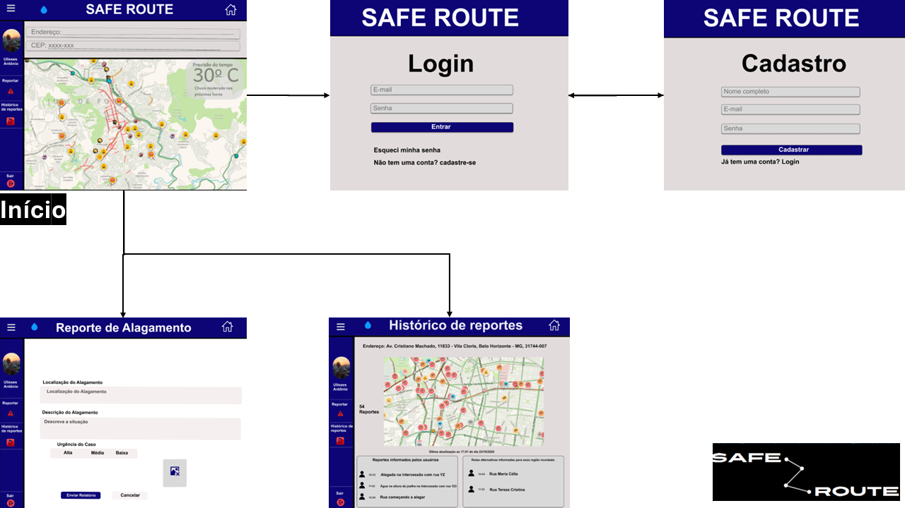
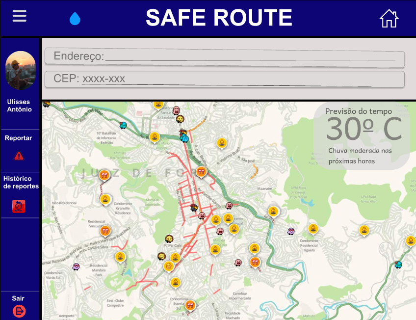
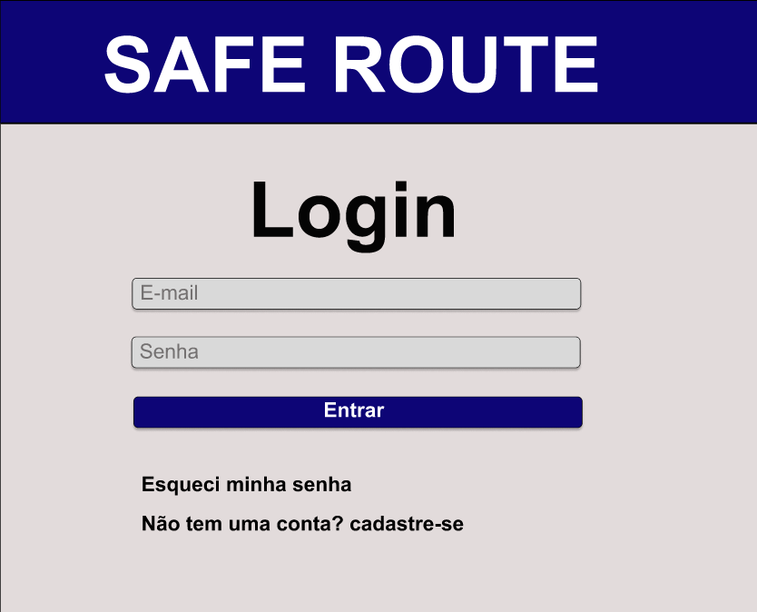
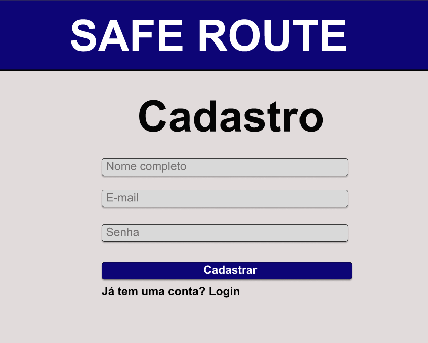
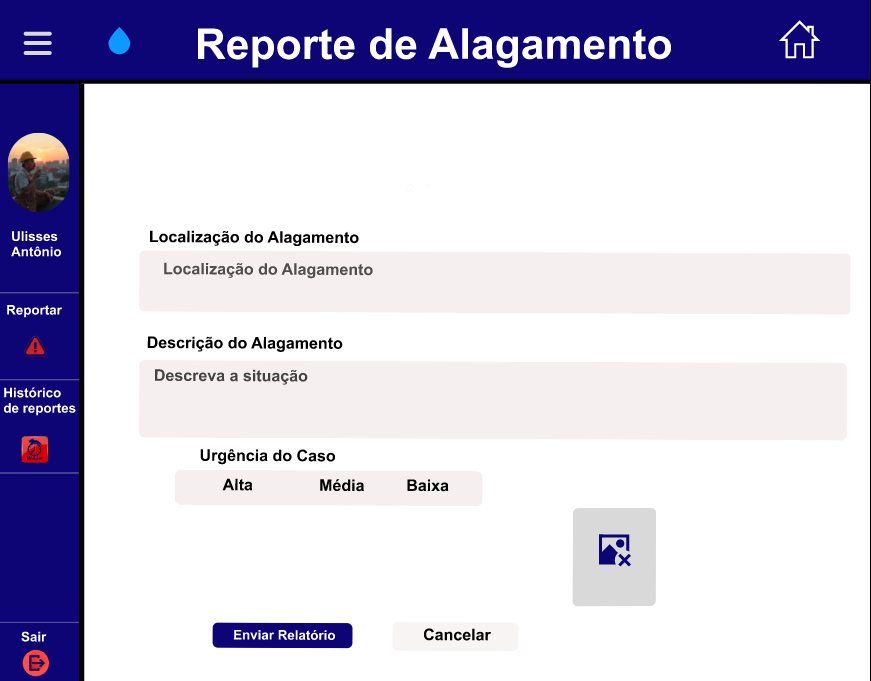
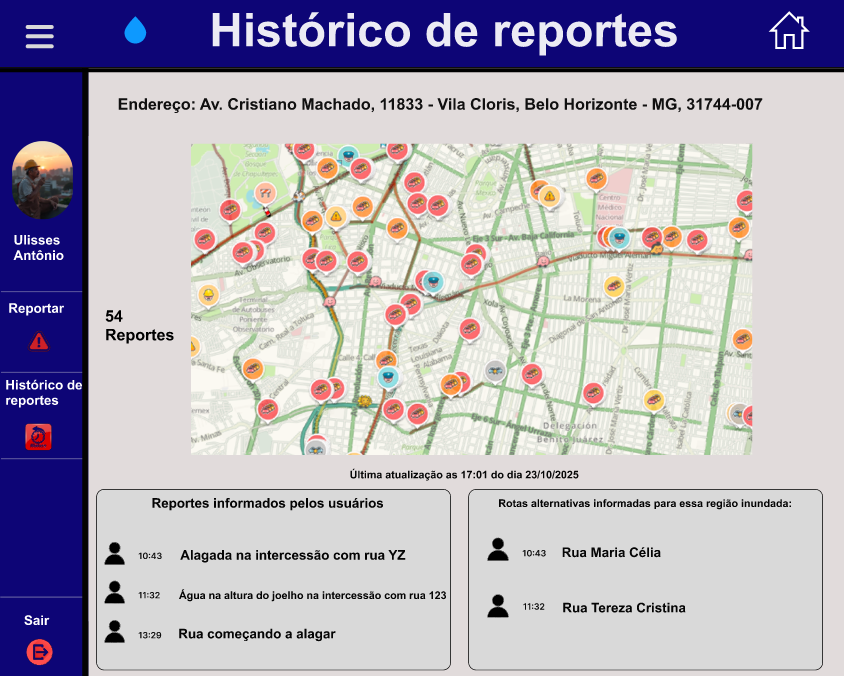

# Projeto de Interface

Visão geral da interação do usuário pelas telas do sistema e protótipo interativo das telas com as funcionalidades que fazem parte do sistema (wireframes).

## User Flow

Fluxo de usuário (User Flow) é uma técnica que permite ao desenvolvedor mapear todo fluxo de telas do site ou app. Essa técnica funciona para alinhar os caminhos e as possíveis ações que o usuário pode fazer junto com os membros de sua equipe. O user flow apresentado demonstra uma navegação simples e bem estruturada, voltada para facilitar a comunicação de ocorrências de alagamento e o acesso a informações críticas durante enchentes e inundações:

1. Tela Inicial (Início)

   Ao fazer login, o usuário é levado à tela principal, onde pode visualizar o mapa com ocorrências em tempo real, previsão do tempo e inserir endereço ou CEP para consultar sua região.
    A navegação lateral permite dois caminhos diretos:

   Reportar uma nova ocorrência.

   Visualizar o Histórico de reportes da região.

3. Login / Cadastro

    O acesso ao sistema é feito via login. Caso o usuário ainda não tenha conta, pode se registrar facilmente clicando em “cadastre-se”, com campos básicos (nome, e-mail e senha).

4. Reporte de Alagamento

    A opção “Reportar” leva o usuário a uma tela de formulário intuitivo, onde ele pode:

   Inserir a localização do alagamento.

   Descrever a situação.

   Definir o nível de urgência (alta, média ou baixa).

   E por fim, enviar o relato com um clique.

5. Histórico de Reportes

    Através do menu lateral ou da tela inicial, o usuário pode acessar a página com o histórico de ocorrências reportadas na região.
    A visualização traz:

   Mapa com ocorrências.

   Relatos de outros usuários.

   Sugestões de rotas alternativas seguras.

O fluxo do usuário no Safe Route foi pensado para garantir rápido acesso à informação, facilidade para reportar alagamentos e segurança no deslocamento, tudo isso com uma interface acessível, responsiva e orientada para o contexto de emergência urbana.

## Wireframes

São protótipos usados em design de interface para sugerir a estrutura de um site web e seu relacionamentos entre suas páginas. Um wireframe web é uma ilustração semelhante do layout de elementos fundamentais na interface e é fundamental sempre relacionar cada wireframe com o(s) requisito(s) que ele atende. Abaixo, é possível consultar os wireframes utilizados no projeto:

A tela inicial do sistema Safe Route apresenta uma interface limpa, intuitiva e altamente funcional, com foco na segurança e orientação do usuário em tempo real. No topo, há campos de busca para inserção de endereço e CEP, facilitando a localização personalizada no mapa logo abaixo. A previsão do tempo aparece em destaque no canto superior direito, informando temperatura e condições climáticas — um recurso crucial em situações de alagamento.

O mapa interativo domina a maior parte da tela e exibe ícones variados que indicam diferentes tipos de ocorrências urbanas (como alagamentos, interdições e obras), destacando em vermelho as vias afetadas. Isso ajuda o usuário a identificar rapidamente as áreas de risco e a planejar rotas alternativas.

Na lateral esquerda, o menu mantém a navegação simples e acessível, com opções para “Reportar”, “Histórico de reportes” e “Sair”, além da exibição do nome e foto do usuário, reforçando a personalização.

A tela de login do aplicativo Safe Route permite que o usuário insira seu e-mail e senha para acessar o sistema, oferecendo também opções para recuperar a senha ou criar uma nova conta caso ainda não seja cadastrado, proporcionando um acesso rápido e intuitivo.

A tela de cadastro do Safe Route permite que novos usuários criem uma conta informando nome completo, e-mail e senha, com um botão para confirmar o cadastro e um link para retornar ao login caso já possuam uma conta.

A tela de "Reporte de Alagamento" permite que o usuário informe a localização e a descrição de um alagamento, selecione o nível de urgência (Alta, Média ou Baixa), e anexe uma imagem da situação. No menu lateral, há opções para acessar o histórico de reportes, sair do sistema e navegar até a tela inicial, além de botões para enviar o relatório ou cancelar a ação.

A tela "Histórico de reportes" apresenta uma interface voltada para a visualização rápida e eficiente de ocorrências de alagamento, com forte foco em usabilidade, clareza e acessibilidade. A navegação lateral fixa à esquerda permite ao usuário alternar com facilidade entre as funções principais: "Reportar", "Histórico de reportes" e "Sair", sendo os ícones bem visuais e reforçados por cores fortes — o vermelho, por exemplo, destaca a ação de reportar (urgente). No topo da tela há uma barra de navegação azul com ícone de menu e botão de retorno à tela inicial (representado pela casinha), reforçando a identidade visual e garantindo consistência no layout. A seção principal centraliza um mapa interativo com ícones coloridos que representam diferentes tipos de reportes (alagamento, sugestão de rota, alerta, etc.), proporcionando feedback visual imediato sobre a situação da região — ótimo para tomada de decisão rápida. A localização é exibida com clareza no topo, seguida por dados em tempo real sobre número de reportes e horário da última atualização, o que transmite confiabilidade e atualidade das informações.

Abaixo do mapa, dois painéis com fundo cinza claro organizam informações adicionais de forma segmentada: o da esquerda mostra os relatos enviados com hora, avatar e texto (em ordem cronológica), enquanto o da direita destaca rotas alternativas sugeridas, facilitando a mobilidade em áreas críticas. A escolha da tipografia e o contraste entre fundo e texto contribuem para leitura clara, enquanto o uso de ícones reforça o entendimento rápido das informações. Essa organização visual intuitiva, aliada ao design limpo e objetivo, favorece uma experiência de uso fluida e eficiente, especialmente importante em cenários emergenciais. A interface demonstra preocupação com acessibilidade e responsividade, sendo adequada tanto para desktop quanto para dispositivos móveis.
